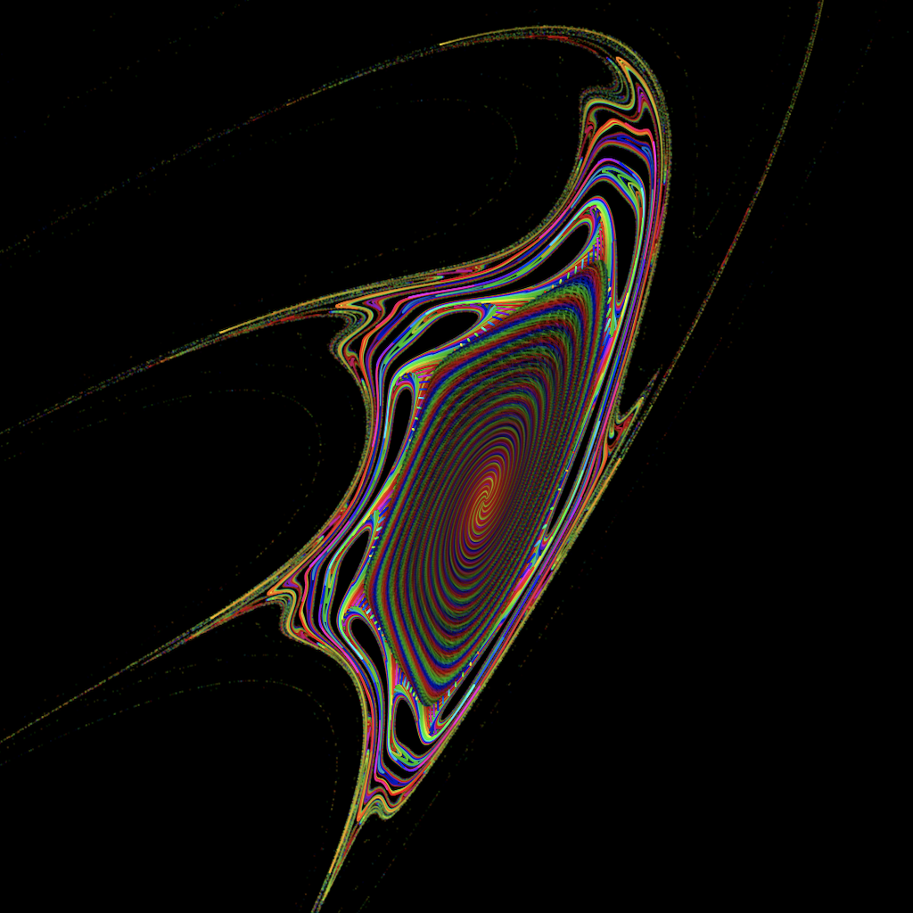

Chaos Equations
===============

[https://acarl005.github.io/chaos-equations-js/index.html](https://acarl005.github.io/chaos-equations-js/index.html)

Real time visualization and animation of dynamic chaos equations.



### Implementation

Built with [React](https://reactjs.org/) and WebGL.
This is based on the equations discovered by [HackerPoet](https://github.com/HackerPoet/Chaos-Equations).
The implementation is forked from [Jered Danielson](https://glitch.com/edit/#!/chaos-equations?path=README.md:1:0).

### Run the Code Locally

Install the dependencies and then run the Parcel dev server on `http://localhost:1234`.

```
git clone https://github.com/acarl005/chaos-equations-js
cd chaos-equations-js
npm install
npm run dev
```

To build for production, use Parcel to bundle the project and then run the Node.js Express server which will serve static files from `/dist`.

```
npm run build
npm start
```

